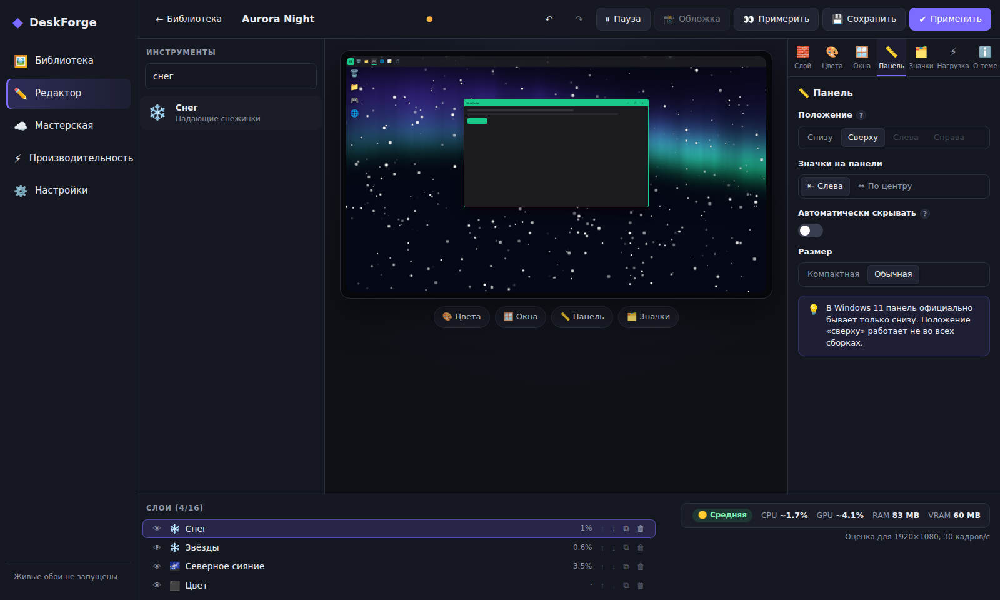

# DeskForge

Студия кастомизации рабочего стола для Steam: живые обои, цвета Windows, стиль окон, положение панели задач, большой редактор для новичков, импорт работ художников в Мастерскую Steam и анализ того, сколько ресурсов ПК тема будет потреблять в фоне.

> Рабочее название — **DeskForge**. Переименовать можно в `package.json` (`productName`), `electron-builder.yml` и `src/renderer/*.html`.



Ещё скриншоты: [библиотека](docs/screenshots/library.png) · [производительность](docs/screenshots/performance.png) · [Мастерская](docs/screenshots/workshop.png)

## Возможности

| Раздел | Что умеет |
| --- | --- |
| **Библиотека** | Встроенные шаблоны, свои темы и темы из Мастерской. Живые миниатюры (анимация при наведении), применение в один клик, копия, удаление, бейдж нагрузки. |
| **Редактор** | Палитра инструментов с поиском «Что вы хотите сделать?» (понимает русский и английский, синонимы, «ё», опечатки), популярные инструменты крупными плитками, живой макет рабочего стола (обои + панель задач + окно + значки), слои, инспектор свойств с подсказками «?», режим новичка (редкие настройки спрятаны), отмена/повтор (Ctrl+Z / Ctrl+Y), Ctrl+S, перетаскивание файлов, «Примерить» на 10 секунд на настоящем рабочем столе, живой счётчик нагрузки. |
| **Слои обоев** | Цвет, градиент (с переливом), картинка (параллакс, медленный зум, размытие), видео, частицы (снег, дождь, светлячки, звёзды, пузыри, сакура; реакция на мышь), шейдеры (северное сияние, волны, плазма, туманность, неоновая сетка), часы, надпись. Прозрачность и режимы смешивания. |
| **Система (Windows)** | Цвет акцента (в т. ч. автоматически по обоям), тёмный/светлый режим, прозрачность, акцент на панели задач и в заголовках, анимации окон, углы/рамки/заголовки окон (Windows 11), положение, выравнивание, размер и автоскрытие панели задач, значки рабочего стола. |
| **Производительность** | Мгновенная оценка (CPU, GPU, RAM, VRAM, ватты на ноутбуке, оценка 0–100) с разбивкой по слоям и для разных разрешений; **реальный замер** — тема 8 секунд работает в невидимом окне, а приложение измеряет процессы рендера/GPU, память и плавность кадров; рекомендации с кнопкой «Исправить». |
| **Мастерская** | Импорт работ художника (перетаскиванием: PNG/JPG/WEBP/GIF/MP4/WEBM или папка с `theme.json`) → готовая тема с подобранным акцентом; чек-лист перед публикацией; обложка снимается с живого предпросмотра (< 1 МБ, как требует Steam); публикация/обновление через Steamworks с прогрессом; бейдж нагрузки автоматически дописывается в описание; список подписок. |
| **Безопасность** | Перед первым изменением сохраняются исходные настройки Windows; «Вернуть исходный рабочий стол» — в один клик (и опционально при выходе). Только пользовательские настройки (HKCU), без прав администратора и без внедрения в процессы — безопасно рядом с античитами. |
| **Фон** | Приложение живёт в трее, обои ставятся на паузу в играх/полноэкранных приложениях и от батареи, ограничение FPS, автозапуск с Windows, несколько мониторов. Интерфейс на русском и английском. |

## Архитектура

```
src/
  shared/                 чистый TypeScript, покрыт тестами
    theme/                формат theme.json (zod-схема), фабрики, встроенные шаблоны
    perf/                 оценщик нагрузки и обработка реального замера
    editor/               история отмен, каталог инструментов и поиск по нему
    workshop/             импорт работ художника, чек-лист публикации
    i18n/                 словари ru / en
    ipc.ts                контракт между окнами и main-процессом
  main/                   Electron main-процесс
    platform/windows.ts   применение темы к Windows (реестр HKCU, SystemParametersInfo, SHAppBarMessage, DWM)
    platform/generic.ts   Linux/macOS: живые обои, системные пункты отключены
    win32/                koffi-привязки Win32, WorkerW (окно за значками), reg.exe
    wallpaperHost.ts      окна обоев на каждом мониторе, пауза в играх/от батареи, параллакс
    perfProbe.ts          реальный замер нагрузки
    steam.ts              Steamworks (steamworks.js): публикация и подписки
    storage.ts            библиотека тем на диске
    protocol.ts           deskforge:// — отдача файлов тем с поддержкой Range для видео
  preload/                безопасный мост window.deskforge
  renderer/
    engine/               движок обоев (общий для редактора и рабочего стола): тикер с лимитом FPS, частицы, WebGL-шейдеры
    editor/               редактор
    pages/                библиотека, Мастерская, производительность, настройки
    wallpaper/            страница, которая рисуется за значками рабочего стола
```

Ключевые решения:

- **Один движок рендера** для предпросмотра и рабочего стола — пользователь видит в редакторе ровно то, что получит.
- **Живые обои за значками** — стандартный приём WorkerW (сообщение `0x052C` окну Progman), учтена новая структура окон Windows 11 24H2.
- **koffi** вместо компилируемых нативных модулей: готовые бинарники, сборка не требует Visual Studio.
- **Нет DLL-инъекций.** Поэтому «анимации окон» — это системные анимации Windows (вкл/выкл), а не произвольные эффекты открытия. Произвольные эффекты требуют внедрения в DWM/Explorer (как WindowBlinds), что конфликтует с античитами и антивирусами — для продукта в Steam это неприемлемый риск.
- Формат темы версионирован (`schemaVersion`) и валидируется при каждом чтении — темы из Мастерской считаются недоверенными.

## Разработка

Требуется Node.js 22+.

```bash
npm install
npm run dev        # Vite + Electron с горячей перезагрузкой
npm test           # unit-тесты (vitest)
npm run typecheck
npm run build      # сборка renderer + main
npm run dist:win   # release/win-unpacked — содержимое для SteamPipe
```

Интерфейс можно открыть и в обычном браузере (`npx vite`) — тогда вместо main-процесса работает встроенная заглушка API (удобно для вёрстки).

## Публикация в Steam

1. Зарегистрируйте приложение в Steamworks, получите **App ID** и **Depot ID**.
2. Укажите App ID в `package.json` → `deskforge.steamAppId` (сейчас `480` — тестовое приложение Valve «Spacewar»). Для локальной разработки положите `steam/steam_appid.txt` рядом с exe; в релиз этот файл не включается (см. `depot_build_win.vdf`).
3. В Steamworks включите **Workshop** (UGC) для приложения и настройте теги — список тегов в приложении: `src/shared/workshop/validate.ts` (`WORKSHOP_TAGS`).
4. Добавьте иконку `build/icon.ico` и пропишите её в `electron-builder.yml`.
5. `npm run dist:win`, затем впишите ID в `steam/scripts/*.vdf` и загрузите сборку: `steamcmd +login <user> +run_app_build steam/scripts/app_build.vdf +quit`.
6. В настройках запуска Steam укажите `DeskForge.exe`, для автозапуска приложение само передаёт `--hidden`.

## Ограничения и что дальше

- Windows 11 официально поддерживает панель задач только снизу; «сверху» работает не во всех сборках, «слева/справа» — только в Windows 10. В редакторе недоступные варианты заблокированы с объяснением.
- Смена положения панели и размера значков требует короткого перезапуска Проводника (можно запретить в настройках).
- Стиль рамок/углов окон применяется ко всем обычным окнам (кроме запущенных от администратора) и действует, пока запущен DeskForge.
- Не реализовано пока: свои курсоры, звуко-реактивные обои, пакеты значков, экспорт темы в файл для обмена вне Steam, тесты UI (сейчас UI проверяется вручную/скриншотами).
- Константы оценщика нагрузки откалиброваны консервативно; после сбора замеров на реальном железе их стоит уточнить (`src/shared/perf/estimator.ts`).
